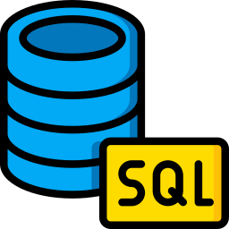
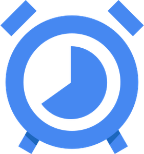
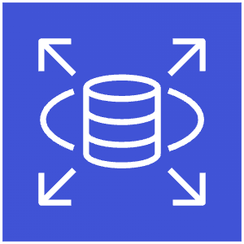
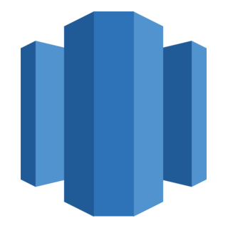
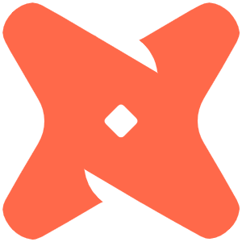
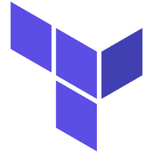
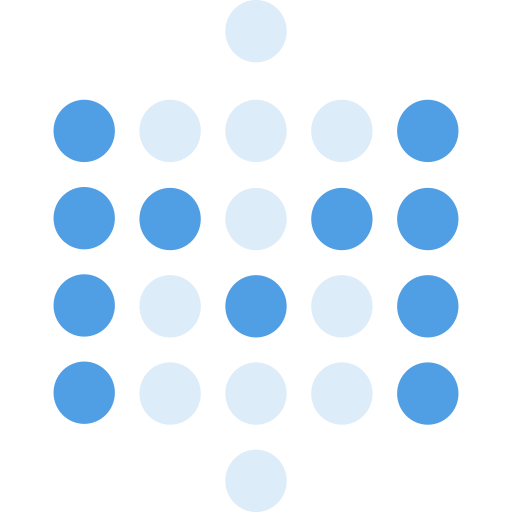
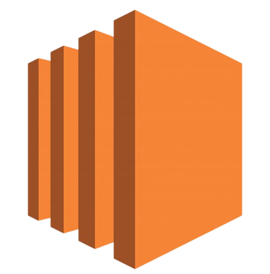
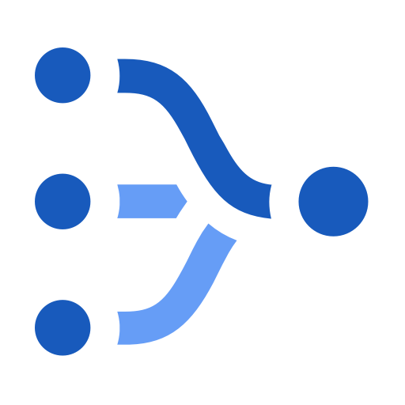
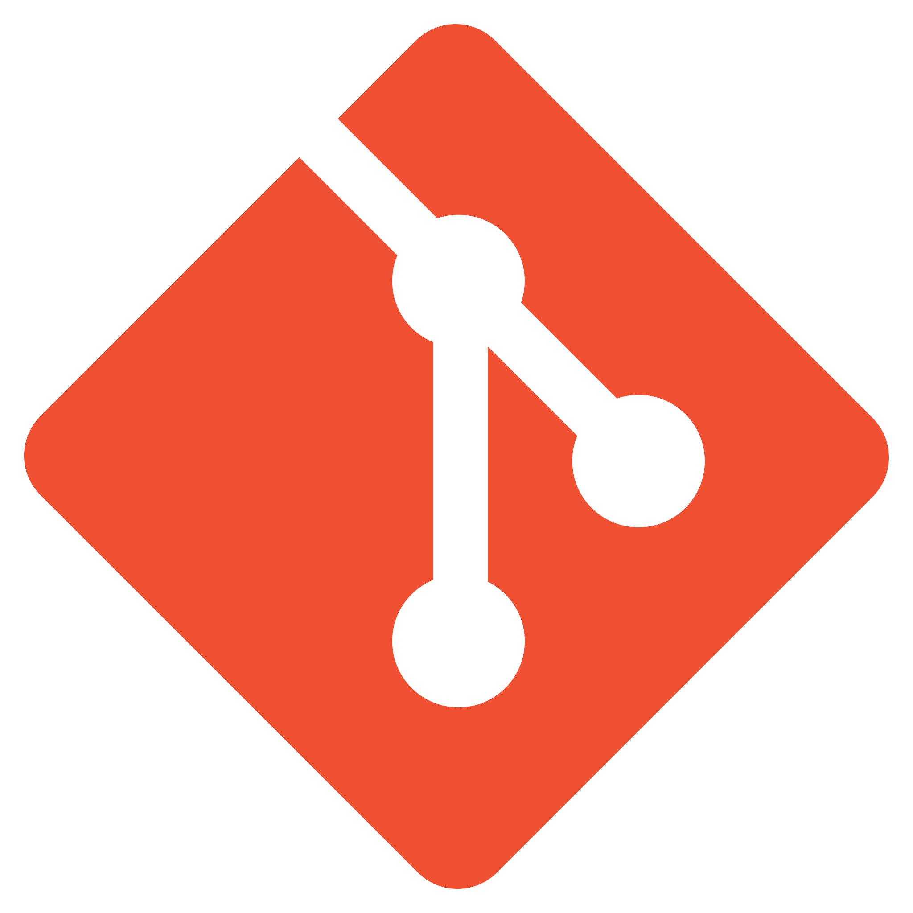

<!-- ======================= -->
<!--        TECH STACK       -->
<!-- ======================= -->

<h3 align="center">🛠 Tech Stack</h3>

<!-- ======================= -->
<!--        LANGUAGES        -->
<!-- ======================= -->
<h4 align="center">💻 Languages</h4>

<table align="center">
  <tr>
    <td align="center" width="96">
       
      <b>Python</b>
    </td>
    <td align="center" width="96">
       
      <b>SQL</b>
    </td>
  </tr>
</table>

<!-- ======================= -->
<!-- DATA ENGINEERING STACK  -->
<!-- ======================= -->
<h4 align="center">⚙️ Data Engineering & Processing</h4>

<table align="center">
  <tr>
    <td align="center" width="96">
       
      <b>Spark</b>
    </td>
    <td align="center" width="96">
       
      <b>Kafka</b>
    </td>
    <td align="center" width="96">
       
      <b>Flink</b>
    </td>
    <td align="center" width="96">
       
      <b>Hadoop</b>
    </td>
    <td align="center" width="96">
       
      <b>Hive</b>
    </td>
  </tr>
</table>

<!-- ======================= -->
<!--     ORCHESTRATION       -->
<!-- ======================= -->
<h4 align="center">🧩 Orchestration & Workflow</h4>

<table align="center">
  <tr>
    <td align="center" width="96">
       
      <b>Airflow</b>
    </td>
    <td align="center" width="96">
       
      <b>AWS MWAA</b>
    </td>
    <td align="center" width="96">
       
      <b>GCP Cloud Scheduler</b>
    </td>
  </tr>
</table>

<!-- ======================= -->
<!--     DATA PLATFORMS      -->
<!-- ======================= -->
<h4 align="center">🗄 Data Warehousing & Databases</h4>

<table align="center">
  <tr>
    <td align="center" width="96">
       
      <b>Snowflake</b>
    </td>
    <td align="center" width="96">
       
      <b>Teradata</b>
    </td>
    <td align="center" width="96">
       
      <b>GCP BigQuery</b>
    </td>
    <td align="center" width="96">
       
      <b>AWS Aurora</b>
    </td>
    <td align="center" width="96">
       
      <b>AWS RDS</b>
    </td>
    <td align="center" width="96">
       
      <b>AWS Redshift</b>
    </td>
    <td align="center" width="96">
       
      <b>GCP Cloud SQL</b>
    </td>
    <td align="center" width="96">
       
      <b>PostgreSQL</b>
    </td>
    <td align="center" width="96">
       
      <b>MySQL</b>
    </td>
  </tr>
</table>

<!-- ======================= -->
<!--     DATA INTEGRATION    -->
<!-- ======================= -->
<h4 align="center">🔄 ELT & Data Integration</h4>

<table align="center">
  <tr>
    <td align="center" width="96">
       
      <b>DBT</b>
    </td>
    <td align="center" width="96">
       
      <b>Rudderstack</b>
    </td>
    <td align="center" width="96">
       
      <b>Fivetran</b>
    </td>
    <td align="center" width="96">
       
      <b>Airbyte</b>
    </td>
    <td align="center" width="96">
       
      <b>Hevo</b>
    </td>
  </tr>
</table>

<!-- ======================= -->
<!--     CLOUD & INFRA       -->
<!-- ======================= -->
<h4 align="center">☁️ Cloud & Infrastructure</h4>

<table align="center">
  <tr>
    <td align="center" width="96">
       
      <b>AWS</b>
    </td>
    <td align="center" width="96">
       
      <b>GCP</b>
    </td>
    <td align="center" width="96">
       
      <b>Terraform</b>
    </td>
    <td align="center" width="96">
       
      <b>Docker</b>
    </td>
    <td align="center" width="96">
       
      <b>Kubernetes</b>
    </td>
  </tr>
</table>

<!-- ======================= -->
<!--     BI & ANALYTICS      -->
<!-- ======================= -->
<h4 align="center">📊 BI & Analytics</h4>

<table align="center">
  <tr>
    <td align="center" width="96">
       
      <b>Looker</b>
    </td>
    <td align="center" width="96">
       
      <b>Tableau</b>
    </td>
    <td align="center" width="96">
       
      <b>Metabase</b>
    </td>
    <td align="center" width="96">
       
      <b>AWS Quicksight</b>
    </td>
    <td align="center" width="96">
       
      <b>Holistics</b>
    </td>
  </tr>
</table>

<!-- ======================= -->
<!--       ML & AI           -->
<!-- ======================= -->
<h4 align="center">🤖 ML & AI Engineering</h4>

<table align="center">
  <tr>
    <td align="center" width="96">
       
      <b>HF</b>
    </td>
    <td align="center" width="96">
       
      <b>Streamlit</b>
    </td>
    <td align="center" width="96">
       
      <b>MLflow</b>
    </td>
    <td align="center" width="96">
       
      <b>FastAPI</b>
    </td>
    <td align="center" width="96">
       
      <b>LangChain</b>
    </td>
    <td align="center" width="96">
       
      <b>Langfuse</b>
    </td>
    <td align="center" width="96">
       
      <b>Qdrant</b>
    </td>
  </tr>
</table>

<!-- ======================= -->
<!--     CLOUD SERVICES      -->
<!-- ======================= -->
<h4 align="center">☁️ Other Cloud Services</h4>

<table align="center">
  <tr>
    <!-- AWS Services -->
    <td align="center" width="96">
       
      <b>AWS Step Functions</b>
    </td>
    <td align="center" width="96">
       
      <b>AWS Glue</b>
    </td>
    <td align="center" width="96">
       
      <b>AWS Lambda</b>
    </td>
    <td align="center" width="96">
       
      <b>AWS Kinesis</b>
    <!-- AWS Data & Compute -->
    <td align="center" width="96">
       
      <b>AWS EC2</b>
    </td>
    <td align="center" width="96">
       
      <b>AWS S3</b>
    </td>
    <td align="center" width="96">
       
      <b>AWS Athena</b>
    </td>
  </tr>

  <tr>
    <!-- GCP Services -->
    <td align="center" width="96">
       
      <b>GCP Scheduler</b>
    </td>
    <td align="center" width="96">
       
      <b>GCP Datastream</b>
    </td>
    <td align="center" width="96">
       
      <b>GCP Cloud Build</b>
    </td>
    <td align="center" width="96">
       
      <b>GCP Cloud Storage</b>
    </td>
    <td align="center" width="96">
       
      <b>GCP Source Repository</b>
    </td>
  </tr>
</table>

<!-- ======================= -->
<!--    DEV & COLLAB         -->
<!-- ======================= -->
<h4 align="center">🧑‍💻 Dev & Collaboration</h4>

<table align="center">
  <tr>
    <td align="center" width="96">
       
      <b>Git</b>
    </td>
    <td align="center" width="96">
       
      <b>Jenkins</b>
    </td>
    <td align="center" width="96">
       
      <b>CircleCI</b>
    </td>
  </tr>
</table>

