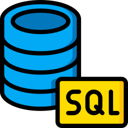
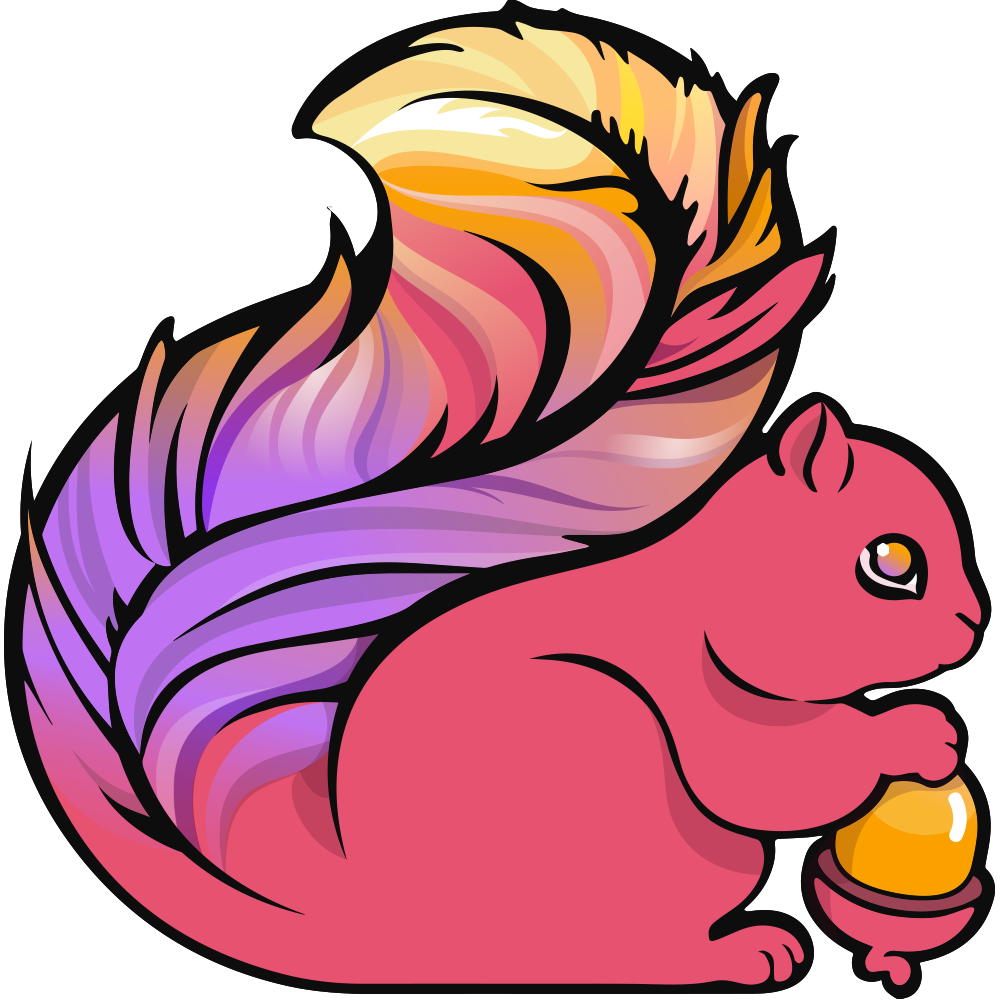
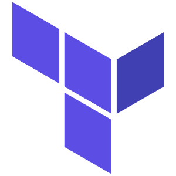
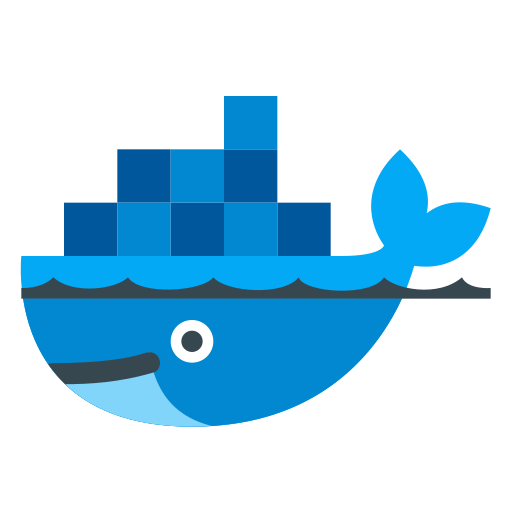
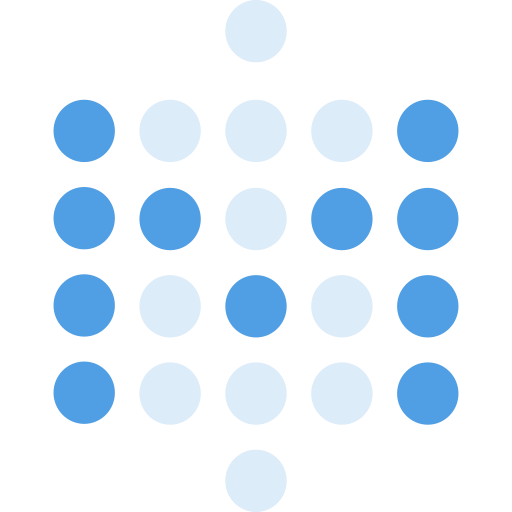
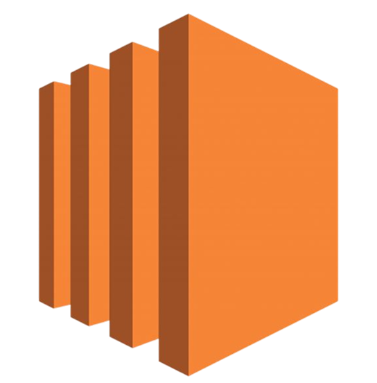
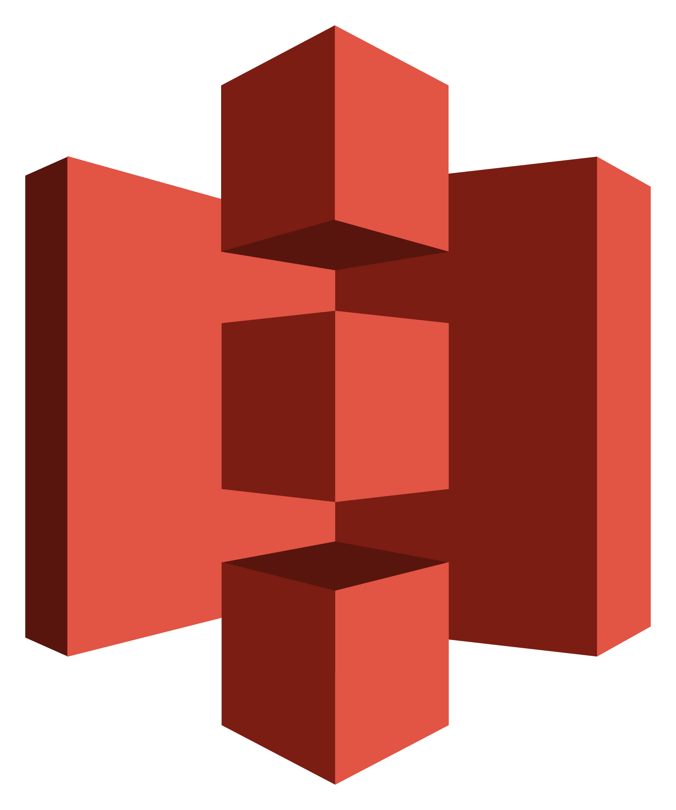
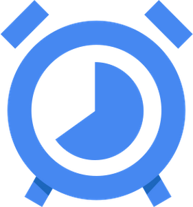
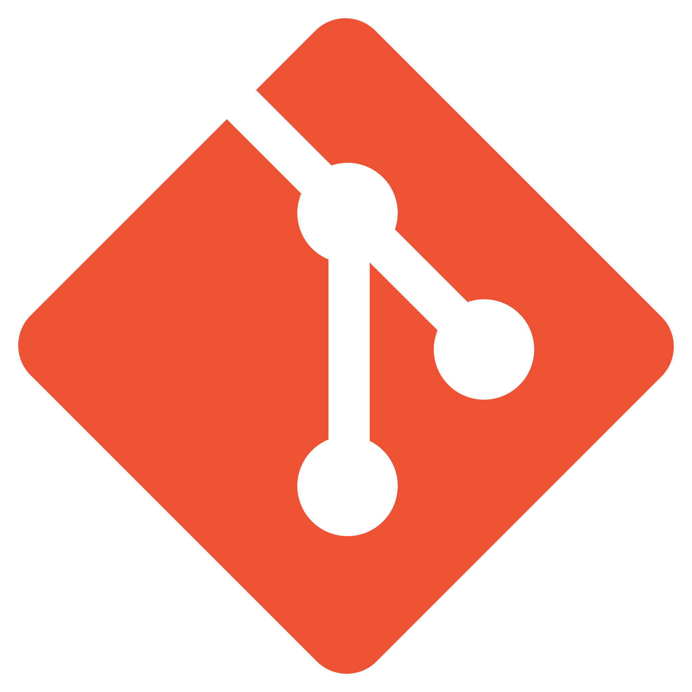

<h1 align="center">Hi 👋, I'm Dogukan Ulu</h1>
<h3 align="center">Senior Data & AI Engineer · Building production-grade pipelines & LLM systems</h3>

  
  &nbsp;
  
  &nbsp;
  
  &nbsp;
  

---

<!-- ======================= -->
<!--     FEATURED PROJECTS   -->
<!-- ======================= -->

<h3 align="center">📌 Featured Projects</h3>

<table align="center">
  <tr>
    <td align="center" width="280">
      <a href="https://github.com/dogukannulu/kafka_spark_structured_streaming">
        <b>🔥 Kafka + Spark Structured Streaming</b>
      </a> 
      Ingest API data via Airflow, stream through Kafka, process with Spark, write to Cassandra  
      
      
    </td>
    <td align="center" width="280">
      <a href="https://github.com/dogukannulu/glue_etl_job_data_catalog_s3">
        <b>☁️ AWS Glue + EMR + S3 Pipeline</b>
      </a> 
      Cloud data engineering on AWS: Glue ETL, EMR Spark jobs, S3 data lake, Athena querying  
      
      
    </td>
    <td align="center" width="280">
      <a href="https://github.com/dogukannulu/streaming_data_processing">
        <b>⚡ Streaming Data Processing</b>
      </a> 
      Kafka → PySpark → Elasticsearch & MinIO. Full streaming pipeline with Airflow orchestration  
      
      
    </td>
  </tr>
  <tr>
    <td align="center" width="280">
      <a href="https://github.com/dogukannulu/airflow_kafka_cassandra_mongodb">
        <b>🧩 Airflow + Kafka + Cassandra + MongoDB</b>
      </a> 
      Produce Kafka messages, consume and write to both Cassandra and MongoDB via Airflow DAGs  
      
      
    </td>
    <td align="center" width="280">
      <a href="https://github.com/dogukannulu/csv_extract_airflow_docker">
        <b>🐳 CSV Extract with Airflow & Docker</b>
      </a> 
      Extract CSV to Postgres, transform with Pandas, orchestrate with Airflow — fully Dockerized  
      
      
    </td>
    <td align="center" width="280">
      <a href="https://github.com/dogukannulu/crypto_api_kafka_airflow_streaming">
        <b>📈 Crypto Data Pipeline</b>
      </a> 
      Stream crypto data from API via Kafka with Airflow, store in MySQL, visualize with Metabase  
      
      
    </td>
  </tr>
</table>

  <a href="https://github.com/dogukannulu?tab=repositories">→ View all repositories</a>

---

<!-- ======================= -->
<!--       TOP ARTICLES      -->
<!-- ======================= -->

<h3 align="center">📝 Top Articles on Medium</h3>

<table align="center">
  <tr>
    <td align="center" width="300">
      <a href="https://medium.com/@dogukannulu/data-engineering-end-to-end-project-1-7a7be2a3671" target="_blank">
        <b>End-to-End Data Engineering</b> 
        Spark · Kafka · Airflow · Docker · Cassandra · Python
      </a>
    </td>
    <td align="center" width="300">
      <a href="https://medium.com/@dogukannulu/aws-cloud-engineering-project-part-1-aws-glue-lambda-kinesis-redshift-athena-quicksight-649fc4d7e0dc" target="_blank">
        <b>☁️ AWS Cloud Data Engineering</b> 
        Kinesis · S3 · Glue · Redshift · Spark · Athena
      </a>
    </td>
    <td align="center" width="300">
      <a href="https://medium.com/apache-airflow/data-engineering-end-to-end-project-part-1-airflow-kafka-cassandra-mongodb-docker-a87f2daec55e" target="_blank">
        <b>Data Streaming</b> 
        Airflow · Kafka · MongoDB · Docker · SQL
      </a>
    </td>
  </tr>
</table>

  <a href="https://medium.com/@dogukannulu">
    → View all articles on Medium
  </a>

---

<!-- ======================= -->
<!--        TECH STACK       -->
<!-- ======================= -->

<h3 align="center">🛠 Tech Stack</h3>

<!-- ======================= -->
<!--        LANGUAGES        -->
<!-- ======================= -->
<h4 align="center">💻 Languages</h4>

<table align="center">
  <tr>
    <td align="center" width="96">
       
      <b>Python</b>
    </td>
    <td align="center" width="96">
       
      <b>SQL</b>
    </td>
  </tr>
</table>

<!-- ======================= -->
<!-- DATA ENGINEERING STACK  -->
<!-- ======================= -->
<h4 align="center">⚙️ Data Engineering & Processing</h4>

<table align="center">
  <tr>
    <td align="center" width="96">
       
      <b>Spark</b>
    </td>
    <td align="center" width="96">
       
      <b>Kafka</b>
    </td>
    <td align="center" width="96">
       
      <b>Flink</b>
    </td>
    <td align="center" width="96">
       
      <b>Hadoop</b>
    </td>
    <td align="center" width="96">
       
      <b>Hive</b>
    </td>
  </tr>
</table>

<!-- ======================= -->
<!--     ORCHESTRATION       -->
<!-- ======================= -->
<h4 align="center">🧩 Orchestration & Workflow</h4>

<table align="center">
  <tr>
    <td align="center" width="96">
       
      <b>Airflow</b>
    </td>
    <td align="center" width="96">
       
      <b>AWS MWAA</b>
    </td>
    <td align="center" width="96">
       
      <b>GCP Cloud Composer</b>
    </td>
  </tr>
</table>

<!-- ======================= -->
<!--     DATA PLATFORMS      -->
<!-- ======================= -->
<h4 align="center">🗄 Data Warehousing & Databases</h4>

<table align="center">
  <tr>
    <td align="center" width="96">
       
      <b>Snowflake</b>
    </td>
    <td align="center" width="96">
       
      <b>Teradata</b>
    </td>
    <td align="center" width="96">
       
      <b>GCP BigQuery</b>
    </td>
    <td align="center" width="96">
       
      <b>AWS RDS & Aurora</b>
    </td>
    <td align="center" width="96">
       
      <b>AWS Redshift</b>
    </td>
    <td align="center" width="96">
       
      <b>GCP Cloud SQL</b>
    </td>
    <td align="center" width="96">
       
      <b>PostgreSQL</b>
    </td>
    <td align="center" width="96">
       
      <b>MySQL</b>
    </td>
  </tr>
</table>

<!-- ======================= -->
<!--     DATA INTEGRATION    -->
<!-- ======================= -->
<h4 align="center">🔄 ELT & Data Integration</h4>

<table align="center">
  <tr>
    <td align="center" width="96">
       
      <b>DBT</b>
    </td>
    <td align="center" width="96">
       
      <b>Rudderstack</b>
    </td>
    <td align="center" width="96">
       
      <b>Fivetran</b>
    </td>
    <td align="center" width="96">
       
      <b>Airbyte</b>
    </td>
    <td align="center" width="96">
       
      <b>Hevo</b>
    </td>
  </tr>
</table>

<!-- ======================= -->
<!--     CLOUD & INFRA       -->
<!-- ======================= -->
<h4 align="center">☁️ Cloud & Infrastructure</h4>

<table align="center">
  <tr>
    <td align="center" width="96">
       
      <b>AWS</b>
    </td>
    <td align="center" width="96">
       
      <b>GCP</b>
    </td>
    <td align="center" width="96">
       
      <b>Terraform</b>
    </td>
    <td align="center" width="96">
       
      <b>Docker</b>
    </td>
    <td align="center" width="96">
       
      <b>Kubernetes</b>
    </td>
  </tr>
</table>

<!-- ======================= -->
<!--     BI & ANALYTICS      -->
<!-- ======================= -->
<h4 align="center">📊 BI & Analytics</h4>

<table align="center">
  <tr>
    <td align="center" width="96">
       
      <b>Looker</b>
    </td>
    <td align="center" width="96">
       
      <b>Tableau</b>
    </td>
    <td align="center" width="96">
       
      <b>Metabase</b>
    </td>
    <td align="center" width="96">
       
      <b>AWS Quicksight</b>
    </td>
    <td align="center" width="96">
       
      <b>Holistics</b>
    </td>
  </tr>
</table>

<!-- ======================= -->
<!--       ML & AI           -->
<!-- ======================= -->
<h4 align="center">🤖 ML & AI Engineering</h4>

<table align="center">
  <tr>
    <td align="center" width="96">
       
      <b>Hugging Face</b>
    </td>
    <td align="center" width="96">
       
      <b>Streamlit</b>
    </td>
    <td align="center" width="96">
       
      <b>MLflow</b>
    </td>
    <td align="center" width="96">
       
      <b>FastAPI</b>
    </td>
    <td align="center" width="96">
       
      <b>LangChain</b>
    </td>
    <td align="center" width="96">
       
      <b>Langfuse</b>
    </td>
    <td align="center" width="96">
       
      <b>Qdrant</b>
    </td>
  </tr>
</table>

<!-- ======================= -->
<!--     CLOUD SERVICES      -->
<!-- ======================= -->
<h4 align="center">☁️ Other Cloud Services</h4>

<table align="center">
  <tr>
    <!-- AWS Services -->
    <td align="center" width="96">
       
      <b>AWS Step Functions</b>
    </td>
    <td align="center" width="96">
       
      <b>AWS Glue</b>
    </td>
    <td align="center" width="96">
       
      <b>AWS Lambda</b>
    </td>
    <td align="center" width="96">
       
      <b>AWS Kinesis</b>
    </td>
    <!-- AWS Data & Compute -->
    <td align="center" width="96">
       
      <b>AWS EC2</b>
    </td>
    <td align="center" width="96">
       
      <b>AWS S3</b>
    </td>
    <td align="center" width="96">
       
      <b>AWS Athena</b>
    </td>
  </tr>

  <tr>
    <!-- GCP Services -->
    <td align="center" width="96">
       
      <b>GCP Datastream</b>
    </td>
    <td align="center" width="96">
       
      <b>GCP Cloud Build</b>
    </td>
    <td align="center" width="96">
       
      <b>GCP Cloud Storage</b>
    </td>
    <td align="center" width="96">
       
      <b>GCP Source Repository</b>
    </td>
    <td align="center" width="96">
       
      <b>GCP Cloud Scheduler</b>
    </td>
  </tr>
</table>

<!-- ======================= -->
<!--    DEV & COLLAB         -->
<!-- ======================= -->
<h4 align="center">🧑‍💻 Dev & Collaboration</h4>

<table align="center">
  <tr>
    <td align="center" width="96">
       
      <b>Git</b>
    </td>
    <td align="center" width="96">
       
      <b>Jenkins</b>
    </td>
    <td align="center" width="96">
       
      <b>CircleCI</b>
    </td>
  </tr>
</table>
